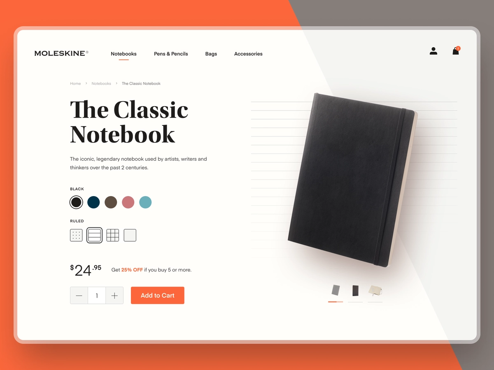

# ArtCulture
[https://nduatik.github.io/artculture/](https://nduatik.github.io/artculture/)

Design by [Tomasz Mazurczak](https://dribbble.com/shots/15668609-Sculpture-Web-concept)



## dependencies

This project requires the latest LTS version of [Node.js](https://nodejs.org/)

```bash
npm install -g elm elm-spa
```

## running locally

```bash
elm-spa server  # starts this app at http:/localhost:1234
```

### other commands

```bash
elm-spa add    # add a new page to the application
elm-spa build  # production build
elm-spa watch  # runs build as you code (without the server)
```

## learn more

You can learn more at [elm-spa.dev](https://elm-spa.dev)